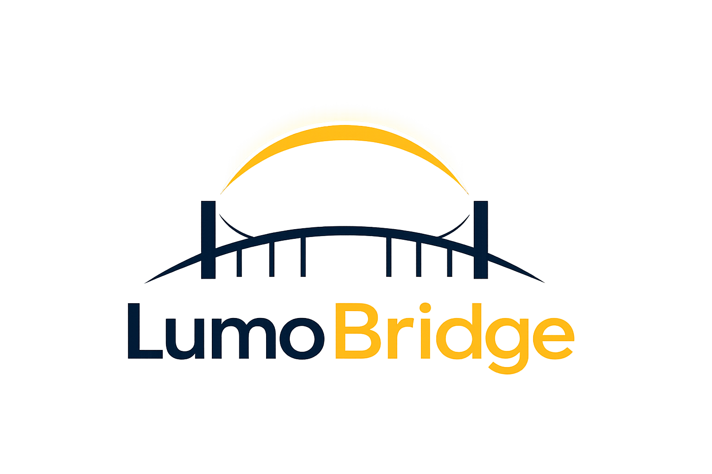

<h2>LumoBridge</h2>

<h3>Product Builder · AI & Analytics Strategist · Founder</h3>

  

  
  
  

  
  
  
  

---

## About me

I am the founder of **LumoBridge**, a digital product company focused on practical, human-centered technology.

I build products that help people and organizations organize important information, make clearer decisions, follow structured progress, document what matters, and use AI in ways that feel useful, responsible, and grounded.

My work sits at the intersection of:

**Product strategy · Business analytics · AI applications · UX thinking · Digital systems · Real-world problem solving**

I am especially interested in products that are not only technically capable, but also **clear, trustworthy, and genuinely useful in people’s lives**.

---

## LumoBridge product ecosystem

<strong>Three connected product domains:</strong> reflection, growth, and workplace documentation.

 

ThriveMap · Cadentra · WorkShield

 

---

# Product 1: ThriveMap

<h3>Guided reflection for clarity, steadiness, and intentional progress</h3>

<strong>ThriveMap</strong> helps users build a more consistent reflection practice through structured sessions, progress tracking, and personal review.

 

<strong>ThriveMap preview:</strong> guided reflection, progress tracking, and structured personal review.

 

<table>
<tr>
<td width="50%" valign="top">

## Core experience

* Guided reflection sessions
* Daily focus and cycle progress
* Reflection history
* Journey summary
* Pattern and growth insights
* Export options for personal review

</td>
<td width="50%" valign="top">

## Designed for

* building a regular reflection rhythm
* organizing personal insight
* noticing patterns over time
* supporting steady, intentional growth
* reviewing progress with more structure

</td>
</tr>
</table>

---

# Product 2: Cadentra

<h3>Guided growth, realistic next steps, and AI-supported progress</h3>

<strong>Cadentra</strong> helps people move through change with more clarity, structure, and confidence.

<table>
<tr>
<td width="45%" valign="top">

## What Cadentra helps with

Cadentra combines goal planning, guided review, reflection, and practical AI coaching to help users understand:

* where they are now
* what matters next
* what is blocking progress
* what small action they can take
* how confidence and clarity change over time

</td>
<td width="55%" valign="top">

<h2>Core experience</h2>

Cadentra is organized around four focus areas, supported by onboarding, progress tracking, weekly review, and practical AI coaching.

<table>
<tr>
<td width="50%" valign="top">

<strong>Career Reinvention</strong>
 
Build a new work direction, business path, or product-led future.

</td>
<td width="50%" valign="top">

<strong>Confidence Rebuild</strong>
 
Rebuild self-trust through small, realistic actions.

</td>
</tr>

<tr>
<td width="50%" valign="top">

<strong>Leadership Growth</strong>
 
Strengthen decisions, communication, and direction.

</td>
<td width="50%" valign="top">

<strong>Personal Direction</strong>
 
Choose what needs attention now and move forward.

</td>
</tr>
</table>

 

<table>
<tr>
<td width="50%" valign="top">

<strong>Guided onboarding</strong>
 
Choose a path and set one realistic goal.

</td>
<td width="50%" valign="top">

<strong>Progress dashboard</strong>
 
Track goals, clarity, check-ins, and next steps.

</td>
</tr>

<tr>
<td width="50%" valign="top">

<strong>Weekly review</strong>
 
Reflect, adjust, and continue with structure.

</td>
<td width="50%" valign="top">

<strong>Practical AI coaching</strong>
 
Get grounded support for planning and action.

</td>
</tr>

<tr>
<td width="50%" valign="top">

<strong>Progress insights</strong>
 
See patterns, obstacles, and movement over time.

</td>
<td width="50%" valign="top">

<strong>Calm interface</strong>
 
Reduce overwhelm and focus on the next useful step.

</td>
</tr>
</table>

</td>

 

 

<strong>Cadentra dashboard:</strong> goals, check-ins, obstacles, clarity growth, weekly rhythm, and AI-supported next steps.

 

<table>
<tr>
<td width="42%" align="center" valign="middle">

</td>
<td width="58%" valign="middle">

<h3>Start with direction</h3>

Cadentra begins by helping users choose a path, set one realistic goal, and understand how the app supports progress through clarity, planning, action, reflection, and adjustment.

</td>
</tr>
</table>

 

---

# Product 3: WorkShield

<h3>Workplace documentation, organized timelines, and preparedness</h3>

<strong>WorkShield</strong> is being developed to help people organize workplace records, document important events, and prepare clearer timelines when they need to explain what happened.

<table>
<tr>
<td width="50%" valign="top">

## WorkShield helps with

* workplace documentation
* timeline building
* organized records
* incident notes
* preparation for conversations
* structured summaries
* safer record keeping

</td>
<td width="50%" valign="top">

## Product direction

WorkShield is focused on helping users turn scattered notes, emails, events, and documents into clearer records.

The goal is to support people who need calm, organized, and practical documentation without making the process feel overwhelming.

</td>
</tr>
</table>

---

## Product research in progress

Strong products should be shaped by **real people, real needs, and real feedback**.

<table>
<tr>
<td align="center" width="33%" valign="top">

<h3>Cadentra</h3>

Guided growth, goals, confidence, weekly review, and agentic AI coaching.

  

</td>

<td align="center" width="33%" valign="top">

<h3>WorkShield App</h3>

Workplace documentation, records, timelines, and preparation.

  

</td>

<td align="center" width="33%" valign="top">

<h3>Private Community</h3>

Exploring a safer space for workplace support and documentation needs.

  

</td>
</tr>
</table>

---

## What I build with

<h3>Product and development</h3>

  
  
  
  
  

<h3>Strategy and systems</h3>

  
  
  
  
  

---

## Product principles

| Principle                          | Meaning                                        |
| ---------------------------------- | ---------------------------------------------- |
| **Clarity before complexity**      | Make products understandable and useful        |
| **Real needs before assumptions**  | Let feedback guide decisions                   |
| **Privacy deserves care**          | Handle sensitive information responsibly       |
| **Useful before flashy**           | Build for value, not noise                     |
| **Structure supports progress**    | Help people know what to do next               |
| **Technology should serve people** | Systems should reduce confusion, not add to it |

---

## Connect and collaborate

I welcome connection with people and organizations working in:

* practical AI applications
* thoughtful product development
* analytics and decision-support systems
* ethical, human-centered technology
* research-informed digital products
* collaboration, partnerships, and aligned opportunities

  
  
  

 

<h3>Building digital tools for clarity, progress, and protection.</h3>

