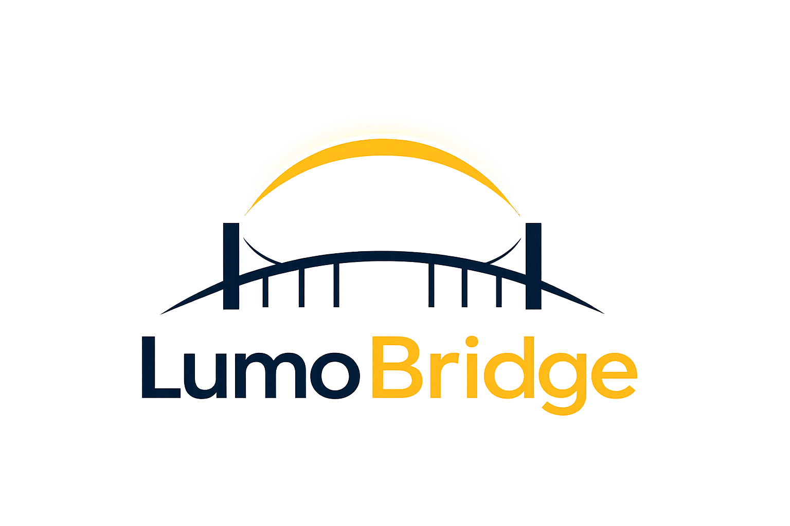

<h3>Building digital tools for clarity, progress, and protection</h3>

  

  

---

## About

I am the founder of **LumoBridge**, a digital product company focused on practical, human-centered technology.

I build tools that help people organize important information, make clearer decisions, follow structured progress, document what matters, and use AI in ways that feel useful, responsible, and grounded.

My work connects:

**Product strategy · Business analytics · AI applications · UX thinking · Digital systems · Real-world problem solving**

---

## Product ecosystem

LumoBridge is building a family of practical tools for reflection, planning, growth, and preparedness.

---

# ThriveMap

<h3>Guided reflection for clarity, practice, and steady progress</h3>

<strong>ThriveMap</strong> helps people build a regular reflection rhythm through calm, structured sessions that move from grounding to one clear takeaway.

<table>
<tr>
<td width="56%" align="center" valign="middle">

  

</td>
<td width="44%" align="center" valign="middle">

  

  

A guided five-step reflection path designed to support focus, insight, and action.

</td>
</tr>
</table>

## ThriveMap experience

<table>
<tr>
<td width="20%" align="center" valign="top">

<h3>Ground</h3>
Start with calm focus.

</td>
<td width="20%" align="center" valign="top">

<h3>Visualize</h3>
Picture the direction.

</td>
<td width="20%" align="center" valign="top">

<h3>Rehearse</h3>
Practice the next action.

</td>
<td width="20%" align="center" valign="top">

<h3>Write</h3>
Capture the insight.

</td>
<td width="20%" align="center" valign="top">

<h3>Anchor</h3>
Close with one takeaway.

</td>
</tr>
</table>

 

<table>
<tr>
<td width="50%" valign="top">

### Core features

* Guided reflection sessions
* Daily focus and cycle progress
* Reflection history
* Journey summary
* Pattern and growth insights
* Export options for personal review

</td>
<td width="50%" valign="top">

### Designed for

* building a regular reflection rhythm
* organizing personal insight
* noticing patterns over time
* supporting steady growth
* reviewing progress with structure

</td>
</tr>
</table>

---

## Connect

I welcome connection with people and organizations working in practical AI, thoughtful product development, analytics, decision-support systems, and human-centered technology.

  

<h3>Building digital tools for clarity, progress, and protection.</h3>

